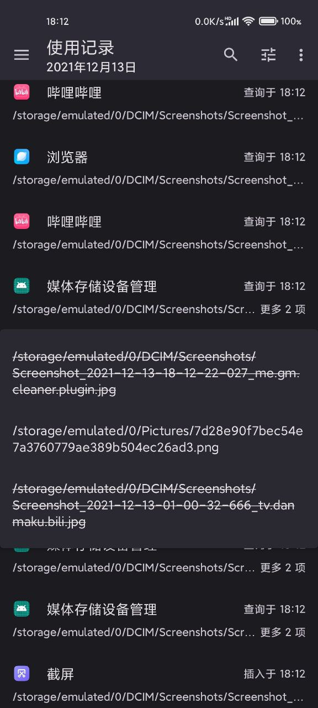

# Media Provider Manager

An Xposed module intended to prevent media storage abuse.

## Screenshots

## 什么是媒体存储

媒体存储库是安卓系统提供的媒体文件索引，当应用需要访问媒体文件时（如相册应用想获取设备中全部图像的列表），相比于遍历外部存储卷中的全部文件，使用媒体库更加高效、方便。另外它还能减少应用可访问的文件，有利于保护用户隐私。

## 媒体存储如何被滥用

与原生存储空间一样，安卓系统没有提供媒体存储的精细管理方案
- 应用只需要低危权限就可以访问全部媒体文件，用户无法限制读取范围
- 无需权限即可写入文件，应用随意写入文件会让存储空间和媒体库混乱，而且还能借此实现跨应用追踪

## 特性

- 媒体文件管理器（无需 root 或 xposed，仅需要读取外部存储空间权限）
- 过滤媒体存储 API 返回的数据，保护隐私数据不被查询
- 防止应用通过媒体存储随意写入文件
- 历史记录功能，了解应用是否使用媒体存储 API，是否有滥用情况
- 使用过时 API 插入文件时执行扫描，如果您通过挂载修改了应用所在的进程的命名空间的目录视图（~~俗称存储重定向~~），此功能能让媒体库及时更新
- 阻止 💩 ROM 的下载管理程序创建不规范文件
- 质感设计 3 界面，简单易用
- 开源

## Source code

[https://github.com/GuhDoy/Media-Provider-Manager](https://github.com/GuhDoy/Media-Provider-Manager)

## Releases

[Github Release](https://github.com/GuhDoy/Media-Provider-Manager/releases/latest)

## License

[Apache License 2.0](http://www.apache.org/licenses/LICENSE-2.0.html)
